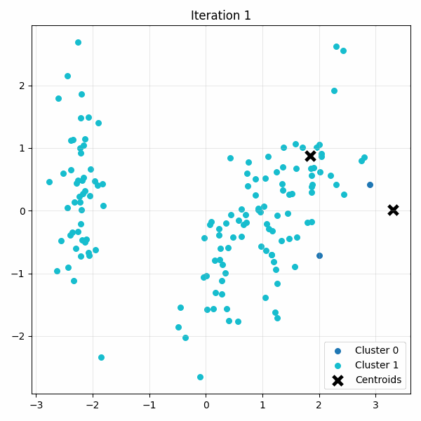

<div align="center">

# K-Means Clustering on Iris Dataset
### Ручная реализация алгоритма K-Means с визуализацией сходимости



*Анимация сходимости центроидов на данных Iris (PCA → 2D)*

</div>

---

Проект по реализации алгоритма кластеризации **K-Means «с нуля»** на чистом NumPy. В качестве демонстрации используется классический датасет **Iris** с полным ML-пайплайном: стандартизация → снижение размерности → автоматический подбор числа кластеров → кластеризация → анимация процесса сходимости.

---

## Математическая постановка

K-Means минимизирует внутрикластерную сумму квадратов расстояний:

$$
J = \sum_{i=1}^{k} \sum_{x \in C_i} \|x - \mu_i\|^2_2
$$

**EM-итерации:**

| Шаг        | Формула                                       | Описание                              |
|------------|-----------------------------------------------|---------------------------------------|
| **E-step** | $c_j = \arg\min_i \|x_j - \mu_i\|_2$          | Присвоение точки ближайшему центроиду |
| **M-step** | $\mu_i = \frac{1}{\| C_i\|}\sum_{x\in C_i} x$ | Пересчёт центроида как среднего |

**Критерий остановки:** $\|\mu^{(t+1)} - \mu^{(t)}\|_2 < \varepsilon$

---

## Пайплайн проекта

```
1. Iris Dataset (4D)

2. StandardScaler (Z-score нормализация)

3. PCA (n_components=2)

4. Silhouette Analysis  автоподбор оптимального k ∈ [2, 10]

5. K-Means (ручная реализация)

6. GIF-анимация сходимости центроидов
```

---

## 📊 Результаты

| Параметр | Значение      |
|----------|---------------|
| Оптимальное $k$ (по Silhouette) | **2**         |
| Silhouette Score | ~0.55         |
| Сходимость | ~5-8 итераций |
| Размерность после PCA | 2D            |


---

## 🗂️ Структура репозитория

```
kmeans-iris-demo/
├── main.py                     # Точка входа, оркестрация пайплайна
├── kmeans_core.py              # Чистая реализация K-Means (E-step, M-step)
├── data_utils.py               # Загрузка Iris, стандартизация, PCA, Silhouette
├── visualize.py                # Покадровая визуализация и генерация GIF
├── requirements.txt            # Зависимости
├── output/
│   └── kmeans_iris_animation.gif   # Анимация (генерируется скриптом)
├── .gitignore
└── README.md                   # Вы здесь
```

### Описание модулей

| Модуль | Ответственность                                                                               |
|--------|-----------------------------------------------------------------------------------------------|
| `kmeans_core.py` | Инициализация центроидов, E-step, M-step, проверка сходимости, обработка пустых кластеров     |
| `data_utils.py` | Загрузка `load_iris`, `StandardScaler`, `PCA`, подбор $k$ через `silhouette_score`            |
| `visualize.py` | `plot_kmeans_step`- отрисовка одной итерации; `create_animation` - сборка GIF через `imageio` |
| `main.py` | Склеивает модули в единый пайплайн: данные -> оптимальный k -> кластеризация -> анимация      |

---

## 🚀 Запуск

### 1. Клонирование и установка

```bash
git clone https://github.com/nali-0/kmeans.git
cd kmeans
pip install -r requirements.txt
```

### 2. Запуск

```bash
python main.py
```

После выполнения в папке `output/` появится `kmeans_iris_animation.gif`.

---

## 🛠️ Реализовано вручную

- [x] Инициализация центроидов (случайный выбор из данных)
- [x] E-step: присвоение кластеров по евклидову расстоянию
- [x] M-step: обновление центроидов
- [x] Проверка сходимости по норме смещения
- [x] История итераций для визуализации
- [x] Покадровая визуализация + сборка GIF

**Из sklearn использовано только:**
- `load_iris` — загрузка данных
- `StandardScaler` — стандартизация
- `PCA` — снижение размерности
- `silhouette_score` — метрика качества кластеризации
- `KMeans` — только для подбора оптимального $k$ через Silhouette

---

## 📦 Зависимости

```
numpy~=2.0.2
matplotlib~=3.9.4
imageio~=2.37.2
scikit-learn~=1.6.1
```
